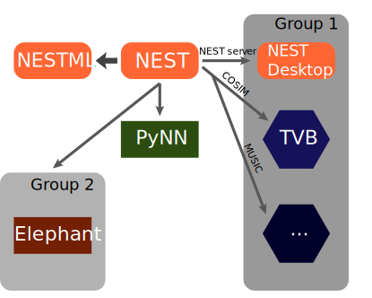
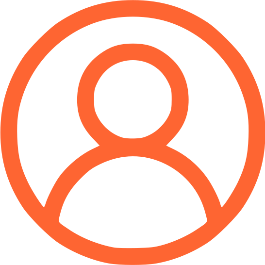
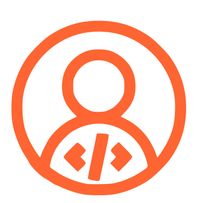
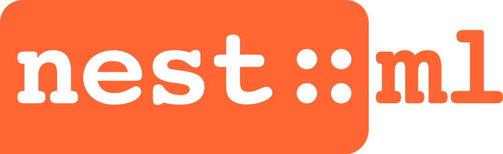

.. design_nest documentation master file, created by
   sphinx-quickstart on Fri Mar 31 20:50:03 2023.
   You can adapt this file completely to your liking, but it should at least
   contain the root `toctree` directive.

Welcome to design_nest's documentation!
=======================================

.. note::

   This is the testing ground for the documentation website design for NEST
   This focuses on the layout, colour scheme,
   UI elements, etc to optimize the user experience.

   The exact correct content is not the main concern. Where the content should go
   and how it should look is the important part.

.. grid:: 1 1 2 2
   :gutter: 2

   .. grid-item-card::
     :columns: 6

     NEST is a simulator for spiking neural networks.
     YOu can do X and Y and why with NEST.

     Main Features:

     1.

     2.

     3.

   .. grid-item-card:: Install NEST
     :columns: auto
     :class-item: sd-fs-5 sd-text-center

     .. code-block:: python

         pip install nest-simulator

Conceptual approach
-------------------

NEST builds networks from point based neurons using connections defined by synapse type ...

.. grid:: 1 1 1 1

   .. grid-item-card::
      :columns: 12

      .. raw:: html

          

          

          

          <map name="image-map" class="popup">
             
             

             <area alt="neuron-triangle" title="neuron-triangle" coords="351,146,291,93" shape="rect" onclick=
             "myFunction()">
             <area target="_blank" alt="neuron-circle" title="neuron-circle" href="index.html" coords="453,311,30" shape="circle">
             <area target="_blank" alt="stimulator-hexagon" title="stimulator-hexagon" href="index.html" coords="124,196,33" shape="circle">
             <area target="_blank" alt="recorder-parallegram" title="recorder-parallegram" href="index.html" coords="502,374,578,410" shape="rect">
             <area target="_blank" alt="neuron-square" title="neuron-square" href="index.html" coords="213,266,265,314" shape="rect">
             <area target="_blank" alt="synapse-arrow" title="synapse-arrow" href="index.html" coords="361,141,328,154,363,229,417,293,442,275" shape="poly">
            </map>
          

Example script
--------------

Here is an example of how a script is constructed . . .

.. seealso::

   :doc:`tutorials` for  other tests of example script

.. grid:: 1 2 2 2
      :gutter: 1

      .. grid-item::
            :columns: 8

            .. code-block:: python

                import nest

                neurons = nest.Create("iaf_psc_alpha", 10000, {
                    "V_m": nest.random.normal(-5.0),
                    "I_e": 1000.0
                })

      .. grid-item::
            :columns: auto
            :class: sd-d-flex-row sd-align-minor-center

            * :py:func:`.Create`
            * :ref:`link_to_neurondocs`

.. grid:: 1 2 2 2
      :gutter: 1

      .. grid-item::
            :columns: 8

            .. code-block:: python

                 input = nest.Create("noise_generator", params={
                    "amplitude": 500.0
                 })

      .. grid-item::
            :columns: auto

            * :ref:`link_to_stimdevices`

.. grid:: 1 2 2 2

      .. grid-item::
            :columns: 8
            :class: sd-text-wrap

            .. code-block:: python

                nest.Connect(input, neurons, syn_spec={'synapse_model': 'stdp_synapse'})
                spikes = nest.Create("spike_recorder", params={
                    'record_to': 'ascii',
                    'label': 'excitatory_spikes'
                })
                nest.Connect(neurons, spikes)

      .. grid-item::
            :columns: auto

            * :py:func:`.Connect`
            * :ref:`link_to_connectiondocs`
            * :ref:`link_to_recorddevices`

.. grid:: 1 2 2 2

      .. grid-item::
            :columns: 8

            .. code-block:: python

                nest.Simulate(100.0)
                nest.raster_plot.from_device(spikes, hist=True)
                plt.show()

      .. grid-item::
            :columns: auto

            * :py:func:`.Simulate`
            * See all PyNEST functions

.. tab-set::

   .. tab-item:: User-level
      :sync: key1

      Here is some information for users about somtihng
      in nest

   .. tab-item:: The technical details
      :sync: key2

      Here is some information for developers about the ihng
      in nest

.. tab-set::

   .. tab-item:: User-level additional
      :sync: key1

      Here is some other information for users about somtihng
      in nest

   .. tab-item:: andmore technical details
      :sync: key2

      Here is some more information for developers about the ihng
      in nest

Install NEST
------------

.. code-block:: python

   pip install nest-simulator

|

or See other options:

.. grid:: 1 1 2 2

   .. grid-item-card::  |user| Install pre-built NEST package
       :class-title: sd-d-flex-row sd-align-minor-center

       I'm a user who wants to :ref:`install NEST on my computer <user_install>`

   .. grid-item-card:: |teacher| Install NEST for a class or workshop
       :class-title: sd-d-flex-row sd-align-minor-center

       I'm a lecturer who wants to :ref:`use NEST to teach <lecturer>`

.. grid:: 1 1 2 2

    .. grid-item-card:: |admin| Install NEST for supercomputers and clusters
       :class-title: sd-d-flex-row sd-align-minor-center

       I'm an admin or user who wants to :ref:`run NEST on HPC <admin_install>`

    .. grid-item-card:: |dev| Install NEST from source
       :class-title: sd-d-flex-row sd-align-minor-center

       I'm a developer who wants to :ref:`do development in NEST <dev_install>`

.. grid:: 1 1 2 2

    .. grid-item-card:: |nestml| Install NEST with NESTML
       :class-title: sd-d-flex-row sd-align-minor-center

       I'm a user who wants to :doc:`create or customize models <nestml:installation>`.

NEST Ecosystem
--------------

Here are tools that integrate with NEST  . . .

.. toctree::
   :caption: USAGE
   :hidden:

   install
   tutorials
   examples
   pynest_api
   models
   glossary
   contact

.. toctree::
   :caption: TECHNICAL
   :hidden:

   hpc
   nest_behavior
   cpp_docs
   architecture
   release_notes
   maintenance

.. toctree::
   :caption: RELATED
   :hidden:

   nest-desktop <https://nest-desktop.readthedocs.io/en/latest/>
   nestml <https://nestml.readthedocs.io/en/latest/>
   nestgpu <https://nestgpu.readthedocs.io/en/latest/>
   pynn
   elephant
   cosim
   tvb
   arbor

Indices and tables
==================

* :ref:`genindex`
* :ref:`modindex`
* :ref:`search`

