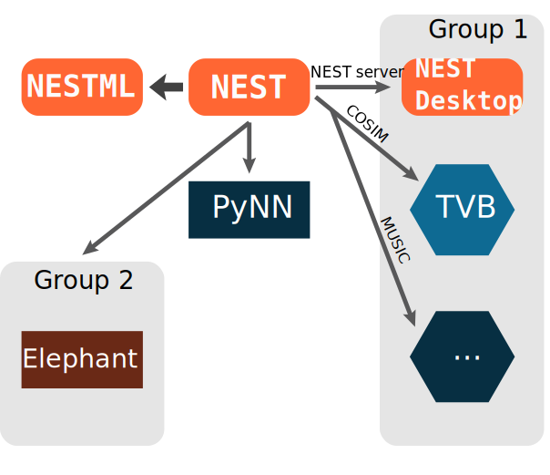

.. design_nest documentation master file, created by
   sphinx-quickstart on Fri Mar 31 20:50:03 2023.
   You can adapt this file completely to your liking, but it should at least
   contain the root `toctree` directive.

Welcome to design_nest's documentation!
=======================================

.. grid::

  .. grid-item::

    NEST is used in computational neuroscience to model and study behavior of large networks of neurons.

    The models describe single :ref:`neuron` and :ref:`synapse` behavior and their connections.
    Different mechanisms of plasticity can be used to investigate artificial learning
    and help to shed light on the fundamental principles of how the brain works.

    NEST offers convenient and efficient commands to define and connect large networks,
    ranging from algorithmically determined connections to data-driven connectivity.
    Create connections between neurons using numerous synapse models from STDP to gap junctions.

    Community-Driven

  .. grid-item-card::

      .. carousel::
          :show_controls:
          :data-bs-ride: carousel

            .. figure:: _static/img/pong_sim.gif

              PLAY PONG with NEST

            .. figure:: _static/img/sudoku_solution.gif

              OR SUDOKU

            .. figure:: _static/img/spatial_test3d.png
              :target: architecture.html

              Create 3D spatially structured networks

            .. figure:: _static/img/structuralplasticity.png

              Showcase cool examples

              Provide users with a glimpse of what nest can do

.. grid:: 1 2 3 3

   .. grid-item-card:: Install NEST
     :class-item: sd-text-center sd-text-white sd-bg-primary

     .. code-block:: python

         pip install nest-simulator

     See more installation options here.

   .. grid-item-card:: Learn NEST
     :class-item: sd-text-center sd-text-white sd-bg-success

     Our PyNEST tutorial will show you how to create your
     first script with NEST simulator. :ref:`tutorial-link <tutorial>`

     Learn how to use  neurons, synapses and devices

   .. grid-item-card:: Explore our models
     :class-item: sd-text-center sd-text-white sd-bg-info

     NEST has extensive model catalog from . . .
     :ref:`Check out our model catalog <modelsmain>`

.. grid:: 1 2 3 3

   .. grid-item-card:: PyNEST API
     :class-item: sd-text-center sd-text-white sd-bg-info

     Find a function

   .. grid-item-card:: Network models 
     :class-item: sd-text-left sd-text-white sd-bg-primary

     * Spatially structured networks ?
     * Microcircuit
     * Mulit area model

   .. grid-item-card::  HPC
     :class-item: sd-text-left sd-text-white sd-bg-success

     * Run NEST on clusters and supercomputers

Conceptual approach
-------------------

NEST builds networks from point based neurons using connections defined by synapse type ...

This is an imagemap. It is possible to create an image map where the individual items link to other pages,
We can also produce pop ups.

But it is very difficult to produce an effect on hover over a specific item in the image map.

The design of this brain is taken directly from NEST desktop, the neuron and synapse
popups are taken from nestml, this gives us some consistency between projects. 
The colours are meant to fit the new colour theme. The brain background is from Angela.

..  

.. grid:: 1 1 1 1

   .. grid-item-card::
      :columns: 12

      .. raw:: html

          

          <map name="image-map" class="popup">
          <area alt="neuron-triangle" title="neuron-triangle" coords="351,146,291,93" shape="rect" onclick="showPopup('popup1')">
          <area alt="neuron-circle" title="neuron-circle"  coords="453,311,30" shape="circle" onclick="showPopup('popup2')">
          <area alt="stimulator-hexagon" title="stimulator-hexagon" coords="124,196,33" shape="circle" onclick="showPopup('popup3')">
          <area alt="recorder-parallegram" title="recorder-parallegram"  coords="502,374,578,410" shape="rect" onclick="showPopup('popup4')">
          <area alt="neuron-square" title="neuron-square" coords="213,266,265,314" shape="rect" onclick="showPopup('popup5')">
          <area alt="synapse-arrow" title="synapse-arrow" coords="361,141,328,154,363,229,417,293,442,275" shape="poly" onclick="showPopup('popup6')">
          </map>
           <!-- popups -->
          

          
          

          

          
          

          

          
          

          

          
          

          

          
          

          

          
          

Example script
--------------

Here is an example of how a script is constructed . . .

.. seealso::

   :doc:`tutorials` for  other tests of example script

.. grid:: 1 2 2 2
      :gutter: 1

      .. grid-item::
            :columns: 8

            .. code-block:: python

                import nest

                neurons = nest.Create("iaf_psc_alpha", 10000, {
                    "V_m": nest.random.normal(-5.0),
                    "I_e": 1000.0
                })

      .. grid-item::
            :columns: auto
            :class: sd-d-flex-row sd-align-minor-center

            * :py:func:`.Create`
            * :ref:`link_to_neurondocs`

.. grid:: 1 2 2 2
      :gutter: 1

      .. grid-item::
            :columns: 8

            .. code-block:: python

                 input = nest.Create("noise_generator", params={
                    "amplitude": 500.0
                 })

      .. grid-item::
            :columns: auto

            * :ref:`link_to_stimdevices`

.. grid:: 1 2 2 2

      .. grid-item::
            :columns: 8
            :class: sd-text-wrap

            .. code-block:: python

                nest.Connect(input, neurons, syn_spec={'synapse_model': 'stdp_synapse'})
                spikes = nest.Create("spike_recorder", params={
                    'record_to': 'ascii',
                    'label': 'excitatory_spikes'
                })
                nest.Connect(neurons, spikes)

      .. grid-item::
            :columns: auto

            * :py:func:`.Connect`
            * :ref:`link_to_connectiondocs`
            * :ref:`link_to_recorddevices`

.. grid:: 1 2 2 2

      .. grid-item::
            :columns: 8

            .. code-block:: python

                nest.Simulate(100.0)
                nest.raster_plot.from_device(spikes, hist=True)
                plt.show()

      .. grid-item::
            :columns: auto

            * :py:func:`.Simulate`
            * See all PyNEST functions

Install NEST
------------

.. code-block:: python

   pip install nest-simulator

|

or See other options:

.. grid:: 1 1 2 2

   .. grid-item-card::  |user| Install pre-built NEST package
       :class-title: sd-d-flex-row sd-align-minor-center

       I'm a user who wants to :ref:`install NEST on my computer <user_install>`

   .. grid-item-card:: |teacher| Install NEST for a class or workshop
       :class-title: sd-d-flex-row sd-align-minor-center

       I'm a lecturer who wants to :ref:`use NEST to teach <lecturer>`

.. grid:: 1 1 2 2

    .. grid-item-card:: |admin| Install NEST for supercomputers and clusters
       :class-title: sd-d-flex-row sd-align-minor-center

       I'm an admin or user who wants to :ref:`run NEST on HPC <admin_install>`

    .. grid-item-card:: |dev| Install NEST from source
       :class-title: sd-d-flex-row sd-align-minor-center

       I'm a developer who wants to :ref:`do development in NEST <dev_install>`

.. grid:: 1 1 2 2

    .. grid-item-card:: |nestml| Install NEST with NESTML
       :class-title: sd-d-flex-row sd-align-minor-center

       I'm a user who wants to :doc:`create or customize models <nestml:installation>`.

NEST Ecosystem
--------------

Here are tools that integrate with NEST  . . .

.. toctree::
   :caption: USAGE
   :hidden:
   :glob:

   install
   tutorials
   examples
   pynest_api
   models
   neurons_nest
   synapses_nest
   devices_nest
   glossary
   contribute <contact>

.. toctree::
   :caption: TECHNICAL DETAILS
   :hidden:

   NEST on HPC <hpc>
   nest_server
   nest_behavior
   cpp_docs
   architecture
   release_notes
   maintenance

.. toctree::
   :caption: RELATED PROJECTS
   :hidden:

   nest-desktop <https://nest-desktop.readthedocs.io/en/latest/>
   nestml <https://nestml.readthedocs.io/en/latest/>
   nestgpu <https://nestgpu.readthedocs.io/en/latest/>
   pynn <https://google.com>
   elephant <https://google.com>
   cosim <https://google.com>
   tvb <https://google.com>
   arbor <https://google.com>

Indices and tables
==================

* :ref:`genindex`
* :ref:`modindex`
* :ref:`search`

.. |user| image:: _static/img/020-user.svg

.. |admin| image:: _static/img/001-shuttle.svg
.. |dev| image:: _static/img/dev_orange.svg
.. |nestml| image:: _static/img/nestml-logo.png
      :scale: 15%
